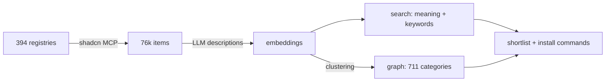

# shadcn Registry Explorer

Find shadcn/ui components for what you're building — 76,162 items from 394 community registries (updated 2026-09-28).

```bash
git clone https://github.com/olyaee/shadcn-registry-explorer
echo "OPENAI_API_KEY=sk-..." > shadcn-registry-explorer/.env
```

Then tell your coding agent: *"Look in ./shadcn-registry-explorer for components to build a fairness dashboard."* It returns install commands and doc links for every UI piece ([`AGENTS.md`](AGENTS.md)). Or search yourself: `./find "grouped bar chart"`, `./find graph category "Kanban Board"`.

## How it works



- **Search** ranks items by meaning and keywords. The OpenAI key embeds your query (fraction of a cent); without it, keywords only.
- **Graph** groups equivalent components across libraries, so `find graph` lists every version of one.

[All registries](REGISTRIES.md) · [MIT](LICENSE) — components belong to their authors.

