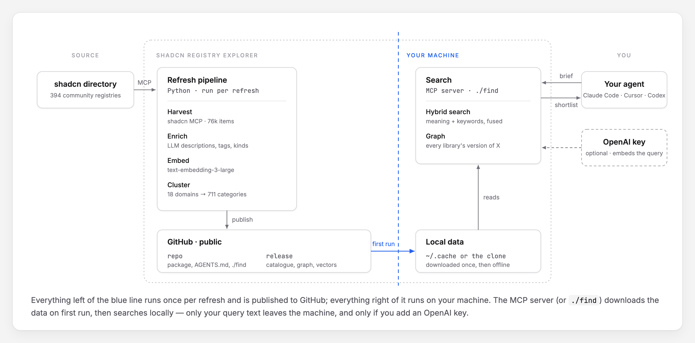

# shadcn Registry Explorer

Find shadcn/ui components for what you're building — 76,162 items from 394 community registries (updated 2026-09-28).

## Install

**As an MCP server** (Claude Code, Cursor, Codex, …; needs [uv](https://docs.astral.sh/uv/)):

```bash
claude mcp add shadcn-explorer -s user -e OPENAI_API_KEY=sk-... -- \
  uvx --from git+https://github.com/olyaee/shadcn-registry-explorer shadcn-explorer-mcp
```

No OpenAI key? Drop `-e …`. Other clients: command `uvx`, args `--from git+https://github.com/olyaee/shadcn-registry-explorer shadcn-explorer-mcp`. Then ask: *"find components to build a fairness dashboard"*. Data (~260 MB) downloads in the background on first start.

**Or clone** and point any agent at the folder ([`AGENTS.md`](AGENTS.md)), or search yourself: `./find "grouped bar chart"`, `./find graph category "Kanban Board"`.

## How it works



- **Search** ranks items by meaning and keywords. The OpenAI key is optional: it embeds your query (fraction of a cent) so "billing toggle" also finds a "monthly/annual switch"; without it, search matches keywords only.
- **Graph** groups equivalent components across libraries, so `browse_category` (MCP) or `./find graph category` lists every version of one.

[All registries](REGISTRIES.md) · [MIT](LICENSE) — components belong to their authors.

